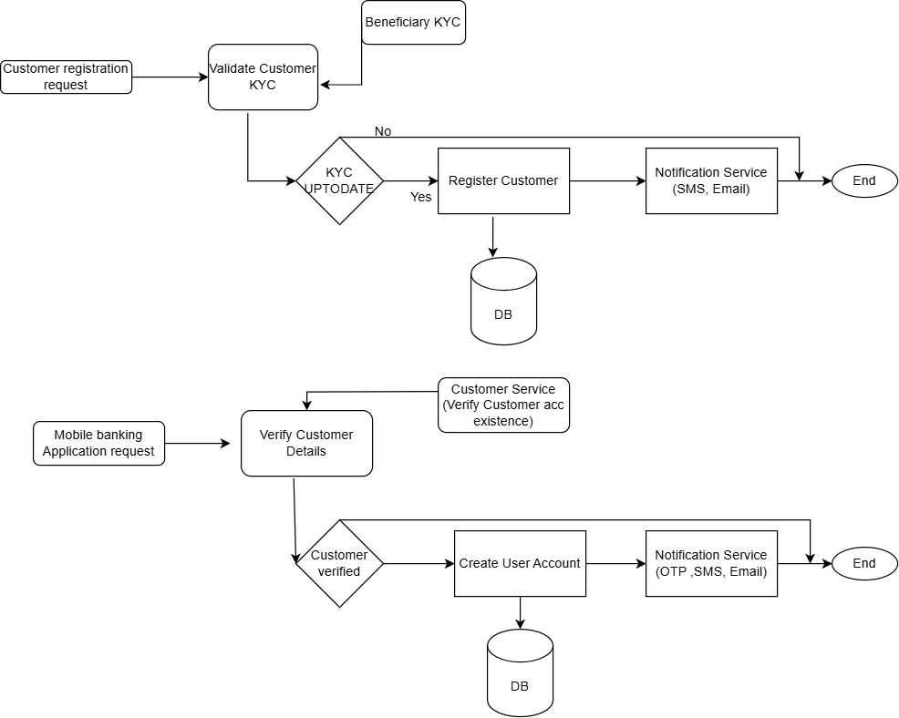

# Banking Application Documentation

## Overview

This repository contains the implementation of a banking application, with various services such as account management, user registration, and bill payment. The following diagrams illustrate the application's architecture, data flow during customer registration, and the process of bill payment.

---

## 1. Application Architecture Diagram

The **Application Architecture Diagram** shows the high-level structure of the banking system. This architecture consists of the following major components:

- **Frontend Layer**: A web-based or mobile interface used by users to interact with the banking system.
- **API Gateway**: The entry point for all requests, which routes to the appropriate backend services.
- **Backend Services**: Includes various services such as:
    - **Account Service**: Handles account-related operations such as balance inquiries, withdrawals, and account registration.
    - **User Service**: Handles customer/user-related operations like user registration, login, and profile management.
    - **OTP Service**: Provides OTP generation and validation for secure operations.
    - **Bill Payment Service**: Facilitates bill payment functionality.
- **Database**: Persistent storage for user data, account details, transaction records, etc.
- **Third-Party Integration**: Includes integrations with external systems such as payment gateways, email providers, and SMS services.

### Diagram:

---

## 2. Customer Registration Data Flow Diagram

The **Customer Registration Data Flow Diagram** illustrates the step-by-step flow of data during the customer registration process. The process typically follows these stages:

1. **A System user/staff Input**: The user provides customer registration details (KYC) (e.g., name, email, beneficiary etc.) via the frontend interface.
2. **API Gateway**: The frontend sends a request to the API Gateway (Nginx), which forwards the request to the `Customer Service`.
3. **Validation**: The `Customer Service` validates the input data (e.g., checks if the email is already in use).
4. **OTP Generation**: If the input data is valid, the `OTP Service` generates a one-time password (OTP) and sends it to the user.
5. **Notification Service** : Customer Registration Consumer - consumes message
6. **Account Creation**: The `Customer Service` creates a user record in the database.
7. **Confirmation**: The user receives a confirmation of successful registration.

### Diagram:

---

## 3. Bill Payment Sequential Diagram

The **Bill Payment Sequential Diagram** shows the interaction between various components of the system during the bill payment process, considering different payment types like electricity, water, airtime, and other merchant payments.

### Process Flow:

1. **User Initiates Payment**:
    - The user selects the bill type (electricity, water, airtime, etc.) and enters payment details (amount, account number, payment method).

2. **API Gateway**:
    - The frontend sends the payment request to the **API Gateway**, which routes it to the relevant backend service (e.g., Bill Payment Service).

3. **Bill Payment Service Validation**:
    - The **Bill Payment Service** validates payment details (biller info, balance, payment method).
    - For merchant payments (electricity, water, airtime), it verifies the payment details with the respective merchant.

4. **Payment Processing**:
    - The **Bill Payment Service** debits the user's account if details are valid.
    - For merchant payments, the service processes the payment through the merchant’s system.

5. **Payment Confirmation**:
    - After successful payment, the **Bill Payment Service** sends a confirmation to the user.
    - Merchant payments include a confirmation from the merchant system (e.g., electricity or airtime provider).

6. **Transaction Record**:
    - The payment is recorded in the database, including transaction details and merchant info (if applicable).
    - A transaction record is created and updates the user's account history.

### Diagram:

